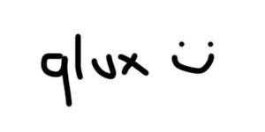

# qlux



qlux is a library for KDB-X. It allows developers to write hyperscript inspired HTML trees and render them to a string.

## Usage

```q
// start q with port 5001
\l qlux.q

my_component: .qlux.h[`div;
    .qlux.h[`h1;"Hello world!"];
    .qlux.h[`p;"This is an example of some HTML written with qlux."];
    .qlux.h[`p;
      "You can pass attributes to elements to enable";
      .qlux.h[`span;enlist[`style]!enlist "color: #ff0000";
        "styling"
      ];
      "or anything else you ";
      .qlux.h[`a;enlist[`href]!enlist "code.kx.com";"want!"]
    ]
  ]

serve: .qlux.app[
  .qlux.index[my_component]
  ];

.z.ph: serve
// navigate to localhost:5001 and you're off to the races!
```

## What is qlux for?

I've been using kdb+/q for many years. What I like most about it is that it's fully featured - I don't need to reach for separate application components (databases, message queues, orchestration tooling) to get things done. Nonetheless, I always found the tools for writing web applications a bit lacking.

This work aims to remove the rough edges in the web application tooling. It is starting as a simple way to compose and render trees of html, and I hope I'll have the opportunity to implement the kind of routing you see in Flask/Next.js, and some things to help manage client/server state and asynchronous queries.

If you're thinking "Great! I can write my whole application, including my database, in a single language! I don't have to learn SQL", I have some disappointing news. I wrote this library thinking "Great! I can write my whole application in a single language - q-SQL!" In this library, the tree of HTML elements are stored in a table, and the HTML is rendered via a q-sql query. It may seem strange, but if you're trying to effectively write in an array language, this is the way to do it.

I think about writing Q in the same way I think about writing regular SQL, noting that it's much more flexible and as such you're expected to implement keywords like PIVOT yourself. The aim of this library is to have very little control flow, no recursion and no loops. `if` statements are used sparingly to throw exceptions when a function receives bad data. I've also tried to make it so most functions operate on lists of things, rather than things themselves.

If you love loops, recursion and control flow, you may be better served by utilising another language to interact with kdb+/q. [PyKX](https://docs.kx.com/3.1/PyKX/home.htm) is one such example.

## Acknowledgements

Thank you to [Aaron Hsu](https://github.com/arcfide) for changing the way I think about trees. I never liked recursion and I hope to never have to use it again.

## How do you use qlux?

`.qlux.h` creates a tree for an html element, with the first argument being the tag (one of h1, p, div, span, a, img - this list is limited for now! just need to add a check for components that don't take children), the second (optional) element being dictionary of properties, and the rest being children (other .qflux.h elements).

`.qlux.route` either takes a function that returns a qlux layout, or subroutes.

`.qlux.app` allows you to define a web application - GET accessible pages at specific routes. If you pass in routes, you'll get back a handler you can pass to `.z.ph`.
